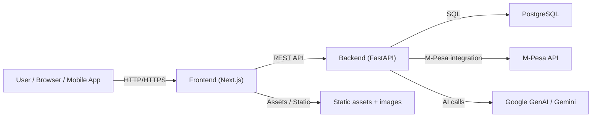
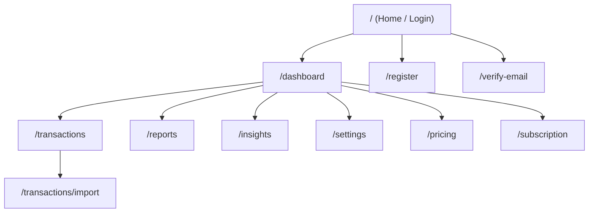
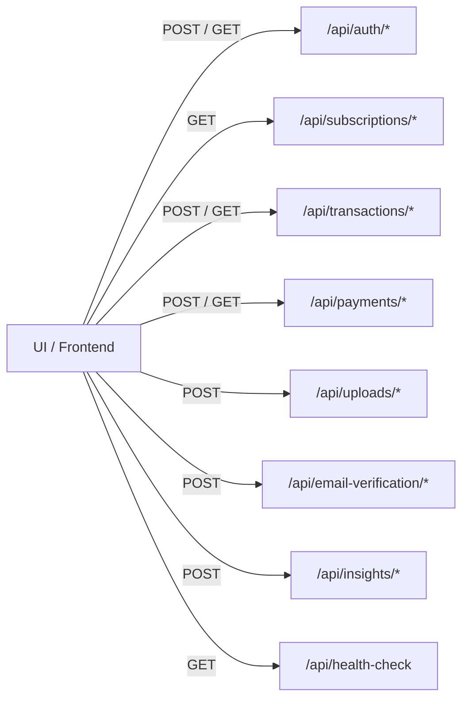
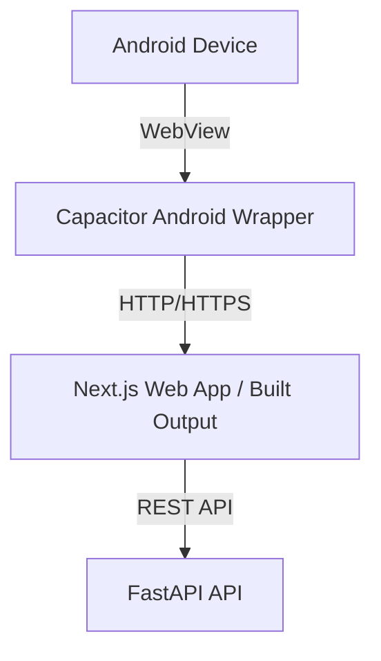

# BiasharaIQ Project URL Diagrams

This document maps the key project URLs, route structure, and deployment flow for BiasharaIQ.

---

## 1. Local Development URLs

- Frontend web app: `http://localhost:3000`
- Backend API: `http://localhost:8000`
- FastAPI docs: `http://localhost:8000/docs`
- Swagger/OpenAPI: `http://localhost:8000/docs`
- Redoc API docs: `http://localhost:8000/redoc`

---
ss
## 2. Architecturesddd URL Flowddss

---

## 3. Frontend Route Diagram

The frontend serves the application pages and mobile wrapper logic.

---

## 4. Backend API URL Diagram

The backend exposes REST endpoints under the main API surface.

---

## 5. Deployment URL Patterns

When deployed, the app is typically hosted at a public domain such as:

- `https://app.example.com` for the frontend
- `https://api.example.com` for the backend
- `https://app.example.com/docs` for API documentation if served through the backend domain

For Docker / ECS deployments, the runtime URLs are driven by the load balancer, ingress, and DNS records.

---

## 6. Mobile Build URL Flow

For Android mobile packaging, the frontend bundles into a Capacitor app.

---

## Notes

- Update this file whenever new route groups or deployment domains are added.
- Use the backend `/docs` endpoint to verify generated API routes against the implemented FastAPI routes.
- If the app is served from a monorepo deployment, replace the frontend and backend domains with the correct application hostnames.
